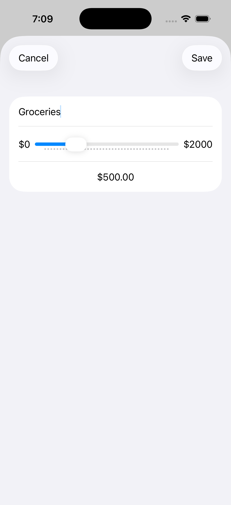
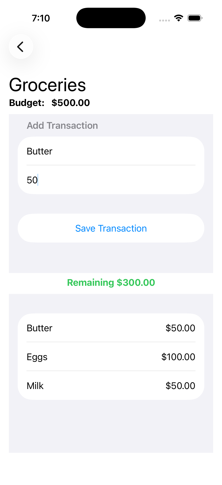
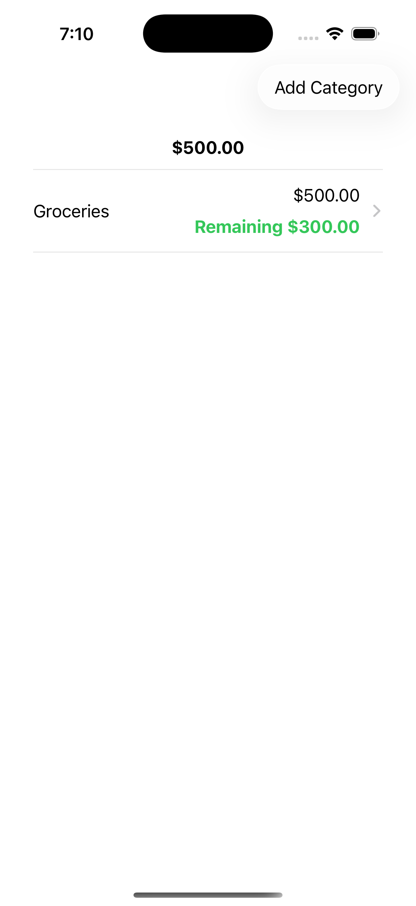

# Budget

A native iOS application built with SwiftUI that allows users to create and manage budgets, organize expenses by categories, track transactions, and monitor their remaining budget.

The application uses **Core Data** for local data persistence and SwiftUI for the user interface and navigation.

## 📸 Screenshots

Add the following screenshots to the `Screenshots` folder in the root of the repository:

- `budget-list.png`
- `add-budget.png`
- `budget-detail.png`
- `transactions.png`

Once added, they will appear here:

<p align="center">
  
  
  
  
</p>

## ✨ Features

### Budget Management

- Create budget categories.
- Define a budget amount for each category.
- Display the total budget.
- Track the amount spent in each category.
- Display the remaining budget.
- Identify when spending exceeds the assigned budget.
- Delete budget categories.

### Transactions

- Add transactions to budget categories.
- Associate transactions with specific budget categories.
- Display transactions belonging to each category.
- Calculate the total amount spent.
- Update the remaining budget based on registered transactions.

### Data Persistence

The application uses **Core Data** to persist budget and transaction information locally.

Budget categories and transactions are stored locally, allowing the application's data to remain available between launches.

### Navigation

The application uses SwiftUI navigation to move between:

```text
Budget List
      ↓
Budget Detail
      ↓
Transactions
```

## 🏗️ Application Structure

The project is organized into views, models, and a Core Data manager.

```text
SwiftUI Views
      │
      ▼
    Models
      │
      ▼
  Core Data
      │
      ▼
CoreDataManager
```

### Views

The application contains SwiftUI views responsible for the different parts of the interface:

- `BudgetListView`
- `AddBudgetCategoryView`
- `BudgetDetailView`
- `BudgetSumaryView`
- `TransactionListView`

These views handle the presentation and user interaction throughout the application.

### Models

The project contains models for:

- Budget categories.
- Transactions.

The models are connected to the Core Data persistence layer.

### Core Data

`CoreDataManager` is responsible for managing the Core Data stack and the application's local persistence.

## 💾 Core Data

The application uses Core Data to store budget information locally.

The main data relationship is:

```text
BudgetCategory
      │
      └── transactions
              │
              ├── Transaction
              ├── Transaction
              └── Transaction
```

A budget category can contain multiple transactions.

This relationship allows the application to calculate the amount spent within each category and determine the remaining budget.

## 🧮 Budget Calculations

The application calculates the remaining budget based on the assigned budget and registered transactions.

```text
Remaining Budget
      =
Budget Amount - Total Transactions
```

This allows users to keep track of their spending within each budget category.

The application also handles situations where the total spending exceeds the assigned budget.

## 🎨 SwiftUI

The user interface is built with **SwiftUI**.

The project uses SwiftUI components and features such as:

- `NavigationStack`
- `NavigationLink`
- `List`
- `Form`
- `Sheet`
- State management
- User input forms
- Navigation between views

SwiftUI is used to create the application's budget management and transaction interfaces.

## 🔢 Number Formatting

The project includes a number-formatting extension used to format numerical values for presentation.

This helps display budget and transaction amounts in a more readable format.

## 📂 Project Structure

```text
BudgetApp/
├── Views/
│   ├── AddBudgetCategoryView.swift
│   ├── BudgetListView.swift
│   ├── BudgetDetailView.swift
│   ├── BudgetSumaryView.swift
│   └── TransactionListView.swift
│
├── Models/
│   ├── BudgetCategory.swift
│   └── Transaction.swift
│
├── Managers/
│   └── CoreDataManager.swift
│
└── Extension/
    └── NumberFormated+Extensions.swift
```

## 🧩 Technologies

- Swift
- SwiftUI
- Core Data
- NavigationStack
- NavigationLink
- List
- Form
- Sheet
- State Management
- NSManagedObject
- NSManagedObjectContext
- @FetchRequest
- Number Formatting
- Xcode

## 🚀 Getting Started

### 1. Clone the repository

```bash
git clone https://github.com/adrian220699/Budget.git
cd Budget
```

### 2. Open the project

```bash
open BudgetApp.xcodeproj
```

### 3. Run the application

Select an iOS Simulator or compatible device in Xcode and press:

```text
▶ Run
```

## 📱 Requirements

The project is configured with:

- iOS 26.5+
- Swift 5.0 language mode

## 📚 What I Learned

This project helped strengthen practical knowledge in:

- Building interfaces with SwiftUI.
- Managing navigation between SwiftUI views.
- Creating forms for user input.
- Working with Core Data.
- Managing `NSManagedObjectContext`.
- Using `@FetchRequest` to retrieve persisted data.
- Creating relationships between Core Data entities.
- Persisting data locally.
- Calculating derived values from stored transactions.
- Organizing a SwiftUI application into reusable views.
- Formatting numerical values for presentation.

## 🔮 Future Improvements

Potential improvements for future iterations include:

- Add editing functionality for existing budgets.
- Add editing functionality for transactions.
- Add additional expense categories.
- Add visual charts for spending analysis.
- Add date-based transaction filtering.
- Add monthly and yearly budget summaries.
- Improve validation for budget and transaction amounts.
- Add unit tests for budget calculations and persistence logic.

